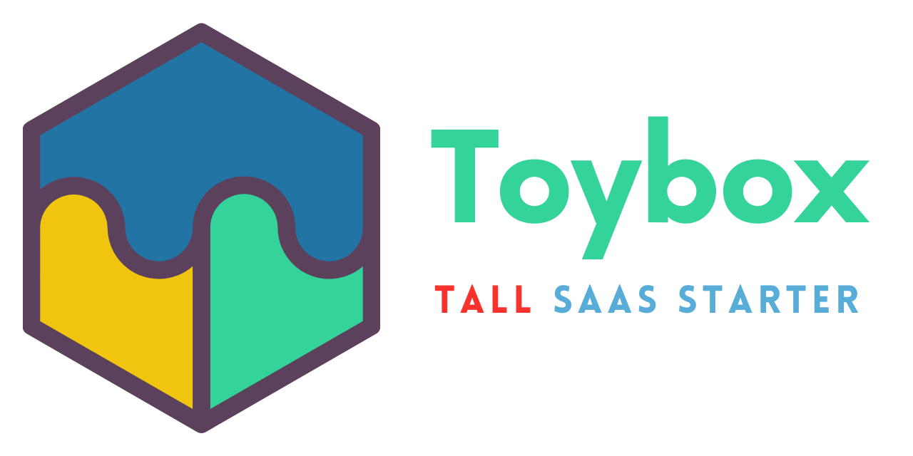

# Toybox - A Laravel micro-SaaS starter kit



---

<!-- TOC -->
* [Toybox - A Laravel micro-SaaS starter kit](#toybox---a-laravel-micro-saas-starter-kit)
  * [Support this project](#support-this-project)
  * [Features](#features)
  * [Components](#components)
  * [Installation/Usage](#installationusage)
    * [Local Development](#local-development)
      * [macOS](#macos)
      * [Linux](#linux)
      * [Windows](#windows)
    * [Production](#production)
      * [Deployment](#deployment)
      * [Troubleshooting](#troubleshooting)
        * [Caddy having issues obtaining SSL](#caddy-having-issues-obtaining-ssl)
  * [Next Steps - DIY](#next-steps---diy)
    * [Post-Setup](#post-setup)
    * [3rd-party Services/Tools](#3rd-party-servicestools)
      * [User Interface](#user-interface)
      * [CMS](#cms)
      * [Media Library](#media-library)
      * [File Storage](#file-storage)
      * [Mail Provider](#mail-provider-)
      * [Payment Provider](#payment-provider)
      * [Event tracking/system notifications](#event-trackingsystem-notifications)
      * [Uptime & Monitoring](#uptime--monitoring)
      * [Analytics](#analytics)
      * [Data Analysis](#data-analysis)
      * [Search](#search)
      * [Websockets](#websockets)
      * [Infrastructure](#infrastructure)
      * [Deployment - CI/CD](#deployment---cicd)
      * [Backups](#backups)
      * [Serverless](#serverless)
      * [Desktop](#desktop)
      * [Mobile](#mobile)
    * [Other Tools not included](#other-tools-not-included)
      * [Filament Plugins & Tricks](#filament-plugins--tricks)
    * [Design](#design)
  * [How to scale](#how-to-scale)
  * [Other recommendations for business operations, launching, etc.](#other-recommendations-for-business-operations-launching-etc)
    * [Helpdesk/Support](#helpdesksupport)
    * [Live Chat](#live-chat)
    * [Knowledgebase](#knowledgebase)
    * [Accounting](#accounting)
    * [Terms & Conditions](#terms--conditions)
  * [Future/Next Steps/TODO](#futurenext-stepstodo)
<!-- TOC -->

My [TALL stack](https://tallstack.dev/) boilerplate for Laravel micro-SaaS/indie hackers.

The Toybox has a bit of everything - a grand tour of the Laravel PHP world, so to speak. Let's have some fun!

Even if you don't need another boilerplate, perhaps the list of [recommended services](#next-steps---diy) will still give you a path forward, or the [scripts](bin) will give you something to work with.

> This project is intended mostly for use as a solo Laravel developer who wants to rapidly develop and deploy indie SaaS projects. This is not intended for junior developers - having worked with the modern Laravel ecosystem is ideal to use this project. This is also not intended for "professional" commercial use, i.e. for freelance clients - it's intended for use by indie developer-entrepreneurs.
 
Principles
- **Self-containment**: With minimal extra commands, you should be able to clone this repo and get something running.
- **Tiny but mighty**: Minimising the different languages used, using simpler & standardised alternatives to common tools.
- **Don't reinvent the wheel**: Use as much of the official & unofficial Laravel ecosystem where applicable. Use popular (i.e. sustainable, gets regular updates) tools & packages where applicable instead of rewriting boilerplate logic from scratch. We're in Laravel, not JS!
- **Customisation**: Don't like my tech choices? It's easy to sub them out.
- **Stability**: Strict types. Automated linting.
- **Simplified Scaling**: It's cheaper to scale with load balancing & bigger servers, and with minor manual input instead of full automation.
- **Local is lekker**: Reducing reliance on third-party services while not reducing capabilities.

Evolution
This project has gone through some changes even before release:
- Octane: removed over concerns with memory leaks and dependencies. There are some strategies around this however, so I might still reimplement it.
- SQLite: it seemed more prudent to skip the step and just get going with MariaDB. Also seemed inconsistent to use SQLite for simplicity but then Redis instead of filesystem/php cache/session/queue drivers.
- Deployer: [lingering issues](https://github.com/deployphp/deployer/issues/3542) and difficulty in testing made it evidently simpler to manage with bash scripts. Envoy is not included for the same reason: any problem it can meaningfully solve is better done either directly in Bash, or for more complexity it's better to use [Envoyer](#deployment).

## Support this project

- [Buy me a coffee](https://tip-jar.co.za/@thecapegreek)
- Sign up to services like OhDear and Paystack with my affiliate links in the [Next Steps](#next-steps---diy) section.
- I also [consult in the Laravel & payments space](https://nik.software)
- Post what you've built using the Toybox and tag me!

## Features

- Self-initialising, self-provisioning, self-deploying.
- Landing page starter
- User authentication, profile & dashboard
- Ready-to-go admin panel
- API-ready

## Components

- **OS**: [Ubuntu 22.04 LTS](https://ubuntu.com/)
- **Webserver**: [Caddy](https://caddyserver.com/)
- **Database**: [MariaDB](https://mariadb.org/)
- **Cache, Queues, Session, Websockets**: [Redis](https://redis.io)
- **Application**: [Laravel](https://laravel.com) (duh)
  - **UI**: [Livewire](https://livewire.laravel.com) (including [Alpine.js](https://alpinejs.dev/)). [Laravel Jetstream](https://jetstream.laravel.com) for authentication, API, profile, and general scaffolding.
  - **Content**:
    - [Landwind-based](https://github.com/themesberg/landwind) landing page, reimplemented with Alpine.js
    - [Laravel SEO](https://github.com/ralphjsmit/laravel-seo)
  - **Authorization**: [Spatie Laravel Permission](https://spatie.be/docs/laravel-permission/v5/introduction) with some basic Filament management of roles & permissions.
  - **Admin panel**: [Filament](https://filamentphp.com/), with included plugins:
    - [Environment Indicator](https://filamentphp.com/plugins/pxlrbt-environment-indicator)
    - [Laravel Filament SEO](https://github.com/ralphjsmit/laravel-filament-seo)
    - [Filament Laravel Health](https://filamentphp.com/plugins/shuvroroy-spatie-laravel-health)
    - [Activity Log](https://filamentphp.com/plugins/pxlrbt-activity-log)
  - **API**: [Laravel Sanctum](https://laravel.com/docs/10.x/sanctum) 
  - **Testing**: [PestPHP](https://pestphp.com/)
  - **Linting**: [Duster](https://github.com/tighten/duster) (includes Laravel Pint) - Minor Pint config changes based on personal style preference, and strict types everywhere.
  - **Observability/Metrics**: [Laravel Telescope](https://laravel.com/docs/10.x/telescope), [Horizon](https://laravel.com/docs/10.x/horizon), and [Laravel Health](https://spatie.be/docs/laravel-health/v1/introduction)
- **CI/CD**: Good old Bash scripts.

## Installation/Usage

### Local Development

In keeping with the spirit of this project, Bash scripts are used for simplicity.

Once you've set up one of the methods below, clone/fork this repository into a new repository, create a database in your MySQL instance. run `./bin/init_dev.sh` to set up pre-commit linting, replace template names, and do Laravel boilerplate setup (package installs, key generate, migrate, etc.). The script will ask you for some basic environment variables (app name, domain, database name) and edit your `.env` accordingly.

Note: By default `init_dev.sh` makes two assumptions:
- Your production server username is `ubuntu`. If it is not, you need to replace `ubuntu` in your Caddyfile and `templates/horizon.conf` with the correct username, once `init_dev.sh` is finished.
- Your local mysql credentials are `root` with an empty password - this is for local development after all. If not, only the last two steps will fail: creating the database, and running migrations & seeders.

Once the script completes, you can commit the changes to the edited files.

For details, look in [bin/init_dev.sh](bin/init_dev.sh).

#### macOS

- ([Valet](https://laravel.com/docs/10.x/valet) & [PHPMon](https://phpmon.app/)) OR [Laravel Herd](https://herd.laravel.com/)
- [DBngin](https://dbngin.com/)

Note: Favicons with Valet-hosted sites are [a bit broken](https://github.com/laravel/valet/issues/375). To fix it, edit your `/opt/homebrew/etc/nginx/valet/valet.conf` using one of [simensen's workarounds](https://github.com/laravel/valet/issues/375#issuecomment-1462164188), or just remove the favicon & robot.text handlers entirely.

#### Linux

- [Valet Linux](https://cpriego.github.io/valet-linux/) OR install PHP manually.
- Install your DB of choice locally

#### Windows

Follow Linux instructions on WSL2. Not sure all of it will work properly though, I don't use Windows.

### Production

This assumes you're starting from scratch on an unmanaged (no Forge/Ploi/Envoyer) Ubuntu server with an `ubuntu` user that has sudo access.

**Note: The `provision_prod.sh` and `deploy.sh` scripts are intended for early use in your SaaS. Once you need to go beyond vertical scaling, I'd highly recommend getting started with the recommended [infrastructure](#infrastructure) and [deployment](#deployment---cicd) tools.**

Your first step is to download your project repository from your VCS. Then, run `./bin/provision_prod.sh` from the project directory. It will:
- Ask you for some basic environment variables (database credentials) and edit your `.env` accordingly. App name, domain & database name will be used from the values in your `.env` (i.e. from when you ran `init_dev.sh`).
- Install PHP (with service config and extensions), Caddy, Redis, and Supervisor
- Setup Caddy to run your Caddyfile **NB:** Caddy will be set up to be run with the `ubuntu` user and not `caddy`.
- Install the Horizon config for Supervisor
- Setup your app (composer & npm install, key generate, migrate, install crontab, etc.). All you need to do is modify your `.env` as needed.

Once this is done, update your local `.env`'s `DEPLOYMENT_PATH` and Caddyfile's `APP_PATH` as prompted by the output. This is to enable the `deploy.sh` script to work and to keep your Caddyfile in line with the production version.

For more details, look in [bin/provision_prod.sh](bin/provision_prod.sh).

#### Deployment

In your local project, edit the following variables to your local `.env`, using the appropriate values:
```dotenv
DEPLOYMENT_IP=
DEPLOYMENT_USER=
DEPLOYMENT_SSH_KEY=
```

`DEPLOYMENT_PATH` should already be set up from when you ran `init_dev.sh`. If not, please edit it to the appropriate value.

To deploy the latest application changes, run `./bin/deploy.sh`. It will:
- SSH into your server using the variables above
- Run `git pull`, `composer install`, `npm install`, `npm run build`, and `php artisan migrate`.

If you're in a rush/need to throw hotfixes up, `bin/quick_deploy.sh` will only pull new code & reset the optimisation caches.

#### Troubleshooting

This is where your skills come in.

##### Caddy having issues obtaining SSL

Make sure your firewall rules allow incoming traffic on port 443. This includes checking security settings with your hosting provider, e.g. AWS security groups.

## Next Steps - DIY

These are the next steps you will have to implement yourself for your project as your needs change & scale.

### Post-Setup

- **Create an admin user**: Run the `php artisan app:create-admin-user` command to create an admin user. This will allow you to access Filament at `/admin`, Horizon at `/horizon`, and Telescope at `/telescope`.
- **DNS**: You'll need to set up some A records to point to your server's IP for your domain.
- **Laravel SEO**: Consult the [main package documentation](https://github.com/ralphjsmit/laravel-seo) as well as the [Filament plugin](https://github.com/ralphjsmit/laravel-filament-seo) on how to handle SEO for your models.
- **Laravel Health**: 
  - If using MySQL or Postgres, consider adding the [Database Connections](https://spatie.be/docs/laravel-health/v1/available-checks/db-connection-count), [Database Size](https://spatie.be/docs/laravel-health/v1/available-checks/db-size-check), and [Database table size](https://spatie.be/docs/laravel-health/v1/available-checks/db-table-size-check) healthchecks. 
  - If using Flare, consider adding the [Flare Error Count](https://spatie.be/docs/laravel-health/v1/available-checks/flare-error-count) healthcheck.
  - If using Meilisearch, consider adding the [Meilisearch](https://spatie.be/docs/laravel-health/v1/available-checks/meilisearch) healthcheck.
  - For pinging any other services (e.g. to test network or other services for health), you can add the [Ping](https://spatie.be/docs/laravel-health/v1/available-checks/ping) healthcheck.
  - If you have multiple queues, you can modify the [Queue](https://spatie.be/docs/laravel-health/v1/available-checks/queue) healthcheck accordingly.
  - To monitor a specific Redis connection, [you can specify the name](https://spatie.be/docs/laravel-health/v1/available-checks/redis#content-customizing-the-thresholds).
  - If you want to monitor _specific_ scheduled jobs, consider installing [spatie/laravel-schedule-monitor](https://github.com/spatie/laravel-schedule-monitor).
- **Laravel Activity log**: Consult the [documentation](https://spatie.be/docs/laravel-activitylog/v4/introduction) to begin logging user activity for analytics.
- **Replaces assets**: You will also want to take some time to remove the Toybox logo, links to the repository and replace any such mentions and authors with your own.
- **Landing page**: 
  - Make sure to change the copy on the provided pages.
  - Assuming these pages are static, make sure they are heavily cached. 
  - For some projects you probably won't even need the landing page provided, so go ahead and yank it out!
- **Queues**: Consult the [Horizon](https://laravel.com/docs/10.x/horizon) documentation on how best to use it for your queues.
- **License**: If your project is closed-source, you might want to remove the `LICENSE.md` file included in the repo.

---

### 3rd-party Services/Tools

**Remember: this is a list of options, not requirements. You can likely run your SaaS perfectly fine without many of these.**

#### User Interface

- Filament is intended to be used for UI where possible. Consult the documentation for details.  
- [Tailwind UI](https://tailwindui.com/) is a great premium resource, and includes many site templates.
- [Alpine Components](https://alpinejs.dev/components) is the premier Alpine component kit.
- [WireUI](https://livewire-wireui.com/) is a Livewire-based component kit.
- [Pines](https://devdojo.com/pines) is an Alpine-based component kit.
- [Blade UI Kit](https://blade-ui-kit.com) is another component kit for the TALL stack.

For more recommendations, see [here](https://writing.nikspyratos.com/Perceptions/Learning/Resources/Tech/Design).

#### CMS

[Statamic](https://statamic.com/) has excellent integration directly into Laravel apps.

Alternatively, there are plenty of other blog/content site providers out there, e.g. [Wordpress](https://wordpress.org/). The CMS space is too huge to make any more specific recommendations.

If you want something free & simple for creating content for your app, consider using [Jigsaw](https://jigsaw.tighten.com/) - a static site generator that uses Markdown & Blade. It's free and easy to use. If hosting it with Github Pages, have a look [here](https://github.com/nikspyratos/thecapegreek-site/blob/master/bin/deploy) on how to remove build artifacts from your main branch.

#### Media Library

Spatie's [Media Library Pro](https://medialibrary.pro/) is excellent. See [below](#other-tools-not-included) for free version details.

#### File Storage

Consider using any [S3-compatible storage service](https://gprivate.com/663g4). The ordinary local disk may be enough for your use case, but it may be prudent to separate this from your app. That way if you don't need a big server but need lots of storage, you don't have to scale your server costs unnecessarily (storage is much cheaper!). 

#### Mail Provider 

[Laravel recommends](https://laravel.com/docs/10.x/mail#introduction) [Mailgun](https://www.mailgun.com/), [Postmark](https://postmarkapp.com/) and [SES](https://aws.amazon.com/ses/). Another option that integrates well, and works for newsletters/marketing campaigns too, is [Mailcoach](https://mailcoach.app/).
 
#### Payment Provider

There are a few options here, depending on your region. For many countries, [Stripe](https://stripe.com) with [Laravel Cashier](https://laravel.com/docs/10.x/billing#introduction) will be fine. Otherwise, have a look at [Paddle](https://www.paddle.com/) (also has a [Cashier plugin](https://laravel.com/docs/10.x/cashier-paddle)) or [Lemon Squeezy](https://lemonsqueezy.com) (Laravel package [here](https://github.com/lmsqueezy/laravel)) for a Merchant of Record. 

If you're in Africa, [Paystack](https://paystack.com/) is a solid option (affiliate signup: [here](https://nik-software.paystack.com/#/signup)). 

For more options, and whether or not you need an MoR, and taxation info see [here](https://writing.nikspyratos.com/Perceptions/Ambition+-+Careers+-+Entrepreneurship/Resources/Payment+Gateways).

#### Event tracking/system notifications

I recommend [LogSnag](https://logsnag.com/).

#### Uptime & Monitoring

I recommend [OhDear](https://ohdear.app/?via=nikspyratos). For error monitoring, [Flare](https://flareapp.io) is also good.

#### Analytics

[Fathom](https://usefathom.com) and [Plausible](https://plausible.io) are great options. If I had to choose: Fathom has more accessible pricing, and is made with Laravel!

#### Data Analysis

I highly recommend checking out [Metabase](https://metabase.com) for this. While it's fairly simple to make graphs/dashboards and track database metrics with Laravel/Filament, Metabase is more specialised for the task and separates concerns nicely. It can also be self-hosted!.

#### Search

[Algolia](https://www.algolia.com/) and [Meilisearch](https://www.meilisearch.com) are the ones supported by [Laravel Scout](https://laravel.com/docs/10.x/scout). Meilisearch can be self-hosted, but can be a handful to manage and would still cost a fair bit in storage/RAM requirements, so you might not save much in time & headaches over using cloud.

#### Websockets

[Pusher](https://pusher.com) and [Ably](https://ably.com) are great paid options in this space, which will be used alongside [Laravel Echo](https://laravel.com/docs/10.x/broadcasting#client-side-installation). If you want to DIY, see [below](#other-tools-not-included).

#### Infrastructure

[Laravel Forge](https://forge.laravel.com/) and [Ploi](https://ploi.io/) are good options (I prefer Ploi) and support many cloud providers. I lean towards AWS, but only because they have a Cape Town region.

#### Deployment - CI/CD

Forge & Ploi offer deployment, but [Envoyer](https://envoyer.io/) is a great addition.

#### Backups

- SQLite: [LiteStream](https://litestream.io/)
- MySQL, volumes, servers, and more: [SnapShooter](https://snapshooter.com/)

#### Serverless

Either [Laravel Vapor](https://vapor.laravel.com/) or roll-your-own setup for free with [Bref](https://bref.sh/). **Note**: this project is untested with serverless. If you get it working with any modifications, make a PR for adding your setup or instructions!

#### Desktop

While still in alpha, [NativePHP](https://nativephp.com/) will hopefully be a very promising option if you'd like to add desktop apps to your toolkit.

#### Mobile

Yeah, nah. Maybe some mad scientist has gotten this one right, but I'd recommend sticking to "normal" mobile tech.

---

### Other Tools not included

- **APIs**
  - **Consuming APIs**: I recommend [Saloon](https://docs.saloon.dev/) - it can be a bit overkill for small APIs, but it really helps with structuring logic with larger APIs and OAuth. I use it as the base for my [Investec Banking API SDK](https://github.com/nikspyratos/investec-sdk-php). 
  - **OpenAPI/Swagger**: [l5-swagger](https://github.com/DarkaOnLine/L5-Swagger) is great here - must-use for writing great APIs. Otherwise, [Scramble](https://scramble.dedoc.co/) is a new entry in the scene.
  - **Data Transfer Objects**: [Laravel Data](https://spatie.be/docs/laravel-data/v3/introduction) should cover you, but if you want something simple and non-Laravel, [dragon-code/simple-dto](https://github.com/TheDragonCode/simple-data-transfer-object) does the job without much overhead. 
- **Excel Import/Export**: [Laravel Excel](https://docs.laravel-excel.com/3.1/getting-started/) - it's a wrapper over PHPSpreadsheet, very convenient. For exports from Filament tables, there's also [Filament Excel](https://github.com/pxlrbt/filament-excel) which uses Laravel Excel under the hood.
- **More Laravel goodies**: [Social login](https://laravel.com/docs/10.x/socialite), [Feature Flags](https://laravel.com/docs/10.x/pennant), [OAuth2](https://laravel.com/docs/10.x/passport), [Search](https://laravel.com/docs/10.x/scout), [Websockets](https://beyondco.de/docs/laravel-websockets/getting-started/introduction) (and [client](https://laravel.com/docs/10.x/broadcasting#client-side-installation)).
- **Manual backups**: [Laravel Backup](https://github.com/spatie/laravel-backup) (with [Filament plugin](https://filamentphp.com/plugins/shuvroroy-spatie-laravel-backup)). If using SQLite you can just do a file download of your database with the `Storage` facade.
- **2FA, Password reset, token management**: For more secure access to admin panels, consider adding [Filament Breezy](https://filamentphp.com/plugins/jeffgreco-breezy). Especially useful if you have a customer-facing Filament panel.
- **Media Management**: Try out [Spatie Media Library](https://spatie.be/docs/laravel-medialibrary/v10/introduction) alongside [Filament's plugin](https://filamentphp.com/plugins/filament-spatie-media-library).
- **Alternative Eloquent Drivers**: [Sushi](https://github.com/calebporzio/sushi) is an array driver, while [Orbit](https://github.com/ryangjchandler/orbit) is a flat file driver. These can be useful for things like CMSes, or loading data into Filament tables (which rely on the Eloquent query builder) without needing a database-driven model.
- **Fixture data**: [Squire](https://github.com/squirephp/squire) adds static fixtures (e.g. airport, country code, currency, timezone) available through Eloquent. 
- **Provisioning & Deployment**: [Deployer](https://deployer.org/).
- **Application settings**: [Spatie Laravel Settings](https://github.com/spatie/laravel-settings) + [Filament Spatie Settings](https://filamentphp.com/plugins/filament-spatie-settings) 

For more niche suggestions and general Laravel resources, check out my [Laravel links page](https://writing.nikspyratos.com/Perceptions/Learning/Resources/Tech/Laravel).

For more tutorials, packages and more, make sure to look at [Laravel News](https://laravel-news.com/).

#### Filament Plugins & Tricks

This boilerplate relies heavily on FilamentPHP for the admin panel building. This also means there are plenty of extra resources to augment either your UI or admin panel:
- [Plugins](https://filamentphp.com/plugins)
- [Community Articles](https://filamentphp.com/community)

### Design

- **Application Colours**: Generate matching application colours with [Coolors](https://coolors.co/), and generate Tailwind palettes from those with [UIColors.app](https://uicolors.app/create).
- **Logo**: Change the contents of [resources/views/vendor/filament-panels/components/logo.blade.php](resources/views/vendor/filament-panels/components/logo.blade.php) to reference your logo image. For favicon generation from the logo, [Real Favicon Generator](https://realfavicongenerator.net/) will create all the images as well as all the HTML you need.
- **Images**: Once you've set up your project, you can delete the default logos & images in `public/images`.

---

## How to scale

This package is a starting point, but as your project scales, you may need to add some more pieces to keep it stable & safe.

You can do most of what is described below with the [infrastructure](#infrastructure) tools recommended.

- **Vertical scale**: Put simply, for some time, it can just be easier to increase the size of your server as your resource demand grows.
- **Content Delivery Network (CDN)**: Sign up for a service like [Cloudflare](https://www.cloudflare.com/) or [Fastly](https://www.fastly.com/) to take the edge off of some of your traffic and protect from DDoS attacks.
- **Separation of concerns**: You may notice some parts of your application require more resources than others. For example, your database needs tons of storage, or your Redis instance takes a lot of RAM. In this case, it can be smarter to switch to either a managed service (e.g. RDS for managed DB, SQS for queues), or spin up a generic server specifically to use that tool.
- **Horizontal scale**: Spin more servers up, and stick a load balancer in front of them. Again managed services for this exist, or you can spin up a generic server with Forge/Ploi and use that for it. Just remember to [modify your scheduled tasks to only run on one server](https://laravel.com/docs/10.x/scheduling#running-tasks-on-one-server).
- **Self hosting**: Some non-app modules of your business might be cheaper to self-host. For example: CMS, Metabase, Websockets. Be careful with this however, as there can be some hidden catch of complexity/cost involved that can make it more attractive to go for the managed service.
- **Octane**: If you've gotten here, are sure your code (and dependencies) won't have memory leaks, and want another option before going with serverless, services or autoscaling, consider switching from PHP-FPM to [Octane](https://laravel.com/docs/10.x/octane).
- **Serverless**: There are two modes of thinking with serverless: pay to make the scale problems go away, or use it for infrequent, burstable task loads that don't need to be in your main app.

If you need _even more_ than that:
- **Splitting into services**: You can split portions of your app into new services, and scale those servers in particular. It's the same as `Separation of concerns`, but for your actual codebase. Note: `service` doesn't have to mean `microservice`.
- **Auto-scaling**: Here be dragons. Take time to learn the tools you need and understand them, or hire professional help. Keywords: Containerisation, orchestration. Or, YOLO and experiment with the [Spatie Dynamic Servers](https://spatie.be/docs/laravel-dynamic-servers/v1/introduction) package.
If you're at the point of needing these and more, congrats! You (hopefully) have a profitable & successful startup. You need to start hiring people. If you're still using this README, you're trying to melt steel with a lighter.

## Other recommendations for business operations, launching, etc.

While this isn't really within the scope of this project, I think it's still valuable to provide some starting recommendations for other entrepreneurs.

The following is a non-exhaustive, and potentially outdated list of recommendations. 

For more resources, such as for launching, advertising, sales, marketing, communities, and incorporating a business, [see here](https://writing.nikspyratos.com/Perceptions/Ambition+-+Careers+-+Entrepreneurship/Resources/Indie+Hacking+-+Solopreneurship+-+Startups+-+Founders).

### Helpdesk/Support

Honestly, using a `support@example.com` email address will be most of what you need. 

Helpdesk systems are only really needed as you need to start building support teams and processes.

Nevertheless, some options are: [Crisp.chat](https://crisp.chat), [GrooveHQ](https://www.groovehq.com/), [HelpScout](https://www.helpscout.com), and [HelpSpace](https://helpspace.com).

### Live Chat

Many of the [Support](#helpdesksupport) recommendations will already have a live chat feature. Otherwise, have a look at [Tawk.to](https://www.tawk.to/) and [Intercom](https://www.intercom.com/).

### Knowledgebase

While you're solo, I'd recommend one of the following:
- [VS Code](https://code.visualstudio.com/) with the [Markdown All In One](https://marketplace.visualstudio.com/items?itemName=yzhang.markdown-all-in-one) extension.
- [Obsidian](https://obsidian.md/) ($50/yr for commercial use, cheaper than Notion)

Once you need to start having the knowledgebase available to others, [Notion](https://notion.so) is my go-to. Notion also supports making public pages, so you can also have your customer knowledgebase there.

### Accounting

I don't know too much in this space other than [Xero](https://www.xero.com).

### Terms & Conditions

- [Avodocs](https://www.avodocs.com/)
- [All sorts of policies available for free by Basecamp](https://github.com/basecamp/policies)
- [GetTerms](https://getterms.io/)


## Future/Next Steps/TODO

- Containers: I'm not intending to create a containerised setup for this, but if you'd like to contribute one, please do!
- Test the scripts - feedback welcome!
- Figure out how to make teams installable on Jetstream after-the-fact
- Perhaps re-try Octane but with some benchmark or worker restarting config

---

[Back to top](#toybox---a-laravel-micro-saas-starter-kit)
